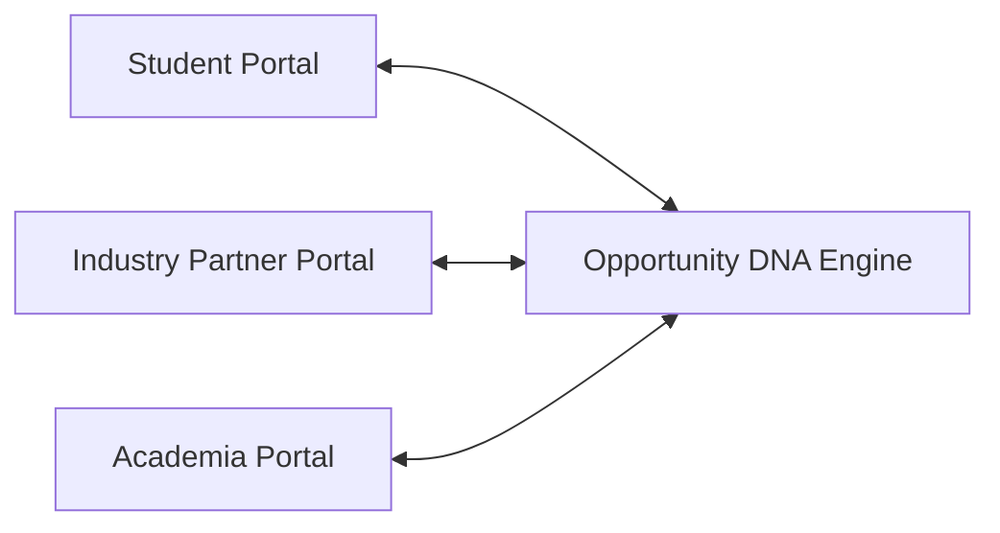

# 00 — Project Overview

## SkillForge — Opportunity DNA
> **Tagline:** *"Find the opportunity. Understand the gap. Build the path."*

**SIH Problem Statement ID:** SIH26044  
**Title:** *"Portal for Academia - Industry collaboration for Skill Mapping, Internships and Placement"*

---

## 1. What is SkillForge — Opportunity DNA?

**SkillForge — Opportunity DNA** is an AI-powered academia-industry collaboration platform designed to align student skillsets with real corporate requirements for internships and permanent placements. 

Unlike traditional placement portals that rely on static resumes, keyword matching, or college reputation, SkillForge introduces **Opportunity DNA**—a verifiable, evidence-backed capability passport. By analyzing real student artifacts (projects, code repositories, work experience, certifications), SkillForge builds a multidimensional profile of a student's true technical capabilities, transparently matches them with industry opportunities, quantifies skill gaps, and provides an actionable upskilling path.

---

## 2. What Problem Does It Solve?

In the current higher education ecosystem in India, three major disconnects exist:

1. **For Students:** Students often do not know whether their skills meet industry standards or what specific skills they need to acquire to land their dream internship or job.
2. **For Industry:** Recruiters receive thousands of keyword-stuffed resumes and struggle to verify actual candidate capabilities, leading to inefficient hiring and bias toward elite institutions.
3. **For Academia / Institutions:** Colleges and universities lack real-time visibility into industry skill demands and cannot identify institutional skill gaps across their student body to improve curriculum and placement outcomes.

SkillForge bridges this gap by creating a single unified ecosystem where **Student Capabilities $\leftrightarrow$ Industry Requirements $\leftrightarrow$ Academic Curriculum** are continuously synchronized.

---

## 3. The Three Primary Users

SkillForge provides customized web portals tailored for three key stakeholders:



| User Role | Primary Needs | SkillForge Solution |
| :--- | :--- | :--- |
| **1. Student** | Needs transparent matching, skill gap awareness, and learning guidance. | Builds a traceable Skill Passport from project evidence, views match scores for corporate internships & placements, simulates readiness, and follows personalized learning roadmaps. |
| **2. Industry Partner / Recruiter** | Needs verified candidate capabilities and streamlined recruitment. | Posts structured internship and placement opportunities, views candidate Opportunity DNA profiles, shortlists applicants through a recruitment funnel, and monitors hiring fairness. |
| **3. Academia / Institution** | Needs visibility into student capabilities vs. market demand. | Accesses macro-level analytics on student skill supply vs. industry demand, identifies institutional skill gaps, and tracks placement and internship outcomes. |

---

## 4. The Core Value Flow

Every interaction in SkillForge follows a linear, evidence-grounded capability pipeline:

```
[Project Artifacts / Resume] 
        ↓ 
[AI Skill Extraction (Gemini AI)] 
        ↓ 
[Canonical Skill Normalization] 
        ↓ 
[Traceable Opportunity DNA Profile] 
        ↓ 
[Deterministic Matching Engine] 
        ↓ 
[Match Score & Skill Gap Identification] 
        ↓ 
[Readiness Simulator & Upskilling Roadmap] 
        ↓ 
[Application & Recruitment Funnel] 
        ↓ 
[Institutional Analytics & Curriculum Alignment]
```

---

## 5. Simple Example: Aarav Sharma's Journey

To understand how SkillForge works in practice, consider a computer science student named **Aarav Sharma**:

1. **Evidence Upload:** Aarav submits details of 3 projects: a *Flower Classification App* using MobileNetV2, an *AI Chatbot* using Ollama/Mistral, and a *Campus Web Portal* using Java & MySQL.
2. **AI Extraction:** Gemini AI extracts 13 capability skills (such as Python, TensorFlow, Computer Vision, REST APIs, and SQL) backed by direct project evidence.
3. **Opportunity DNA:** SkillForge calculates Aarav's Opportunity DNA signal—a 63.0% match for an **AI/ML Engineering Intern** position at Bharat AI Innovations Ltd.
4. **Gap Identification:** The matching engine reveals that Aarav meets all machine learning requirements but lacks **Docker** (Beginner) and **SQL** (Intermediate).
5. **Readiness Simulation:** Aarav uses the Readiness Simulator to see that acquiring Docker (+12.2%) and SQL (+10.2%) will boost his match score to **85.4%**.
6. **Upskilling & Application:** SkillForge generates a 1.1-month upskilling roadmap. Aarav applies for the internship via the Student Portal.
7. **Recruitment & Institution Tracking:** The recruiter views Aarav's verifiable Skill DNA and shortlists him. Simultaneously, Aarav's college sees Docker as a top institutional skill gap across its student body and plans a technical workshop.

---

## 6. What is Implemented vs. Future Scope

| Feature Area | Current Status | Description |
| :--- | :--- | :--- |
| **Skill Passport & Evidence** | ✅ Implemented | Project evidence parsing, AI skill discovery, traceable confidence scoring. |
| **Matching & DNA Engine** | ✅ Implemented | Deterministic multi-factor scoring algorithm for internships and placements. |
| **Application Lifecycle** | ✅ Implemented | Real database-backed `applied` $\rightarrow$ `shortlisted` $\rightarrow$ `offered` $\rightarrow$ `placed` funnel. |
| **Readiness & Roadmap** | ✅ Implemented | Interactive readiness score simulation and gap-based learning roadmap generation. |
| **Analytics & Dashboards** | ✅ Implemented | Recruiter skill demand analytics and Institutional supply vs. demand gap dashboard. |
| **User Authentication / RBAC**| 🔵 Future Scope | Current version uses role/profile workspace switching; production RBAC is planned. |
| **LMS / Course Integration** | 🔵 Future Scope | External course platform auto-enrollment; currently provides curated resource links. |
