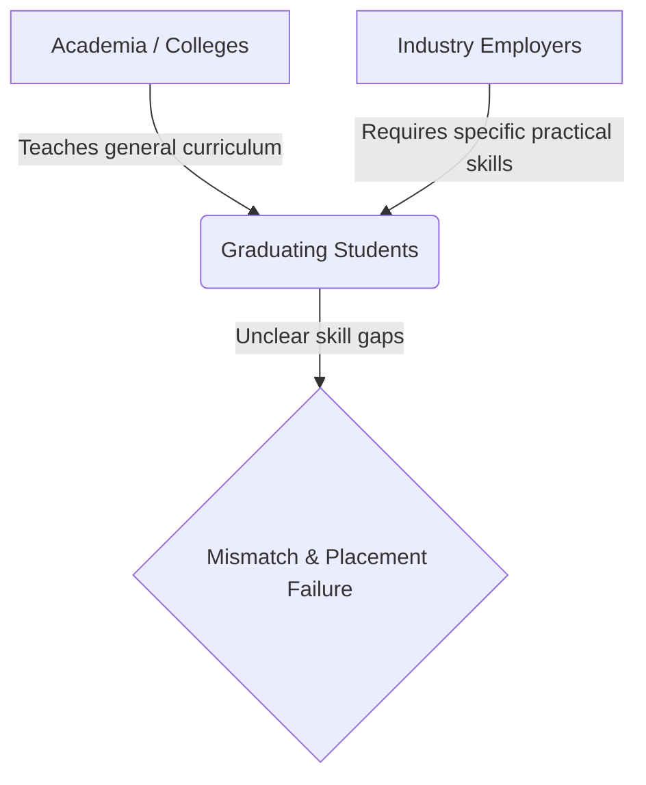

# 01 — Problem Statement

## SIH Problem Statement Details

* **Problem Statement ID:** SIH26044
* **Title:** *"Portal for Academia - Industry collaboration for Skill Mapping, Internships and Placement"*
* **Category:** Software / Web Application
* **Domain:** Education Technology, Human Capital & Workforce Development

---

## 1. The Core Challenge

Higher education systems in India face a persistent challenge in aligning academic training with industry expectations. Despite millions of graduates entering the workforce annually, employers frequently report a significant "employability gap," while students struggle to find suitable internships and placement opportunities.

### The Three Disconnects:

1. **The Student Perspective:**
   - Lack of clarity on what specific technical capabilities employers are looking for.
   - Resume black holes where non-elite college candidates are filtered out before evaluation.
   - Absence of clear, personalized guidance on how to bridge missing skills to become job-ready.

2. **The Industry / Employer Perspective:**
   - Flood of unverified, self-reported resumes containing stuffed keywords.
   - Inability to gauge authentic hands-on project experience without expensive manual technical screening.
   - Lack of tools to map corporate job requirements to real student evidence objectively.

3. **The Academia / Institutional Perspective:**
   - Colleges operate in a silo, unaware of emerging industry skill demands in real-time.
   - Placement cells manage recruitment manually without data-driven insights into institutional skill supply vs. demand gaps.
   - Inability to make data-backed adjustments to elective courses, workshops, or training programs.

---

## 2. Intended Portal Capabilities (SIH26044 Requirements)

To resolve SIH26044 effectively, a comprehensive solution must provide:

1. **Skill Mapping & Profiling:** Automated discovery and mapping of student skills from authentic project evidence and academic history.
2. **Opportunity Management:** A centralized portal for posting, filtering, and managing corporate internships and permanent placement positions.
3. **Transparent Matching:** Evidence-grounded candidate-to-opportunity matching that prioritizes verified skill proficiency over superficial resumes.
4. **Interactive Readiness & Learning Roadmaps:** Tools for students to simulate skill acquisition and access personalized upskilling paths.
5. **Academia-Industry Collaboration Dashboard:** Macro analytics for educational institutions to compare student skill supply with industry demand, prioritize skill gaps, and track student outcomes.

---

## 3. Scope & Implementation Matrix

To maintain technical integrity, the table below maps every SIH26044 expectation to its actual implementation status in **SkillForge — Opportunity DNA**:

| Capability Requirement | Implementation Status | Implementation Details in SkillForge |
| :--- | :--- | :--- |
| **Evidence-based Skill Extraction** | ✅ Implemented | Gemini AI extracts capability skills with confidence scores from uploaded project descriptions and PDFs (`analyzer.py`). |
| **Canonical Skill Taxonomy** | ✅ Implemented | Normalizes skill name variations into a canonical database catalog (`normalization.py`, `models.py`). |
| **Internship & Placement Posting** | ✅ Implemented | Industry partners can post both internship (`type='internship'`) and placement (`type='placement'`) opportunities with required skills and duration. |
| **Deterministic Capability Matcher** | ✅ Implemented | Multi-factor weighted formula scoring capability overlap, proficiency depth, and evidence strength (`matcher.py`). |
| **Application & Funnel Tracking** | ✅ Implemented | Real SQLite database lifecycle (`applied` $\rightarrow$ `shortlisted` $\rightarrow$ `offered` $\rightarrow$ `placed`) with persistence. |
| **Interactive Readiness Simulator** | ✅ Implemented | Real-time score projection based on selected missing skills (`router.py`, `App.tsx`). |
| **Personalized Upskilling Roadmap** | ✅ Implemented | Generates prioritized learning milestones with estimated hours and resource links (`roadmap.py`). |
| **Academia Supply vs. Demand Dashboard**| ✅ Implemented | Institutional analytics API calculating student supply %, industry demand %, and prioritized skill gaps (`router.py`, `App.tsx`). |
| **Fairness & Bias Audit** | ✅ Implemented | Counterfactual bias audit engine evaluating gender, region, income, and pedigree neutrality (`fairness.py`). |
| **National NATS / NAPS Portal API Sync** | 🔵 Future Scope | External government API integration is not implemented; system uses self-contained SQLite backend. |
| **Live LMS Video Integration** | 🔵 Future Scope | Course resource links provided; embedded video playback LMS is planned for future releases. |
