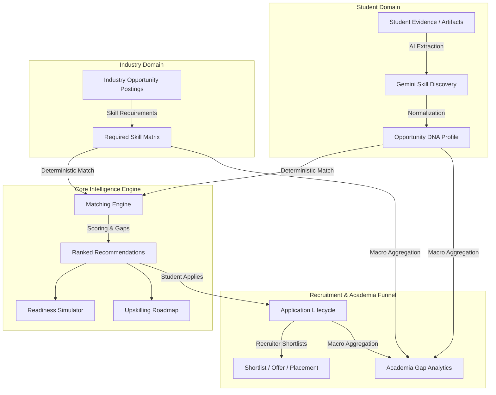

# 02 — Solution Overview

## The SkillForge Solution Concept

**SkillForge — Opportunity DNA** transforms academia-industry collaboration by replacing subjective keyword matching with an evidence-grounded, multi-tenant ecosystem.

---

## 1. Core Architectural Pillars

The solution rests on five technical pillars:

### Pillar 1: Evidence-Grounded Skill Passport (Opportunity DNA)
Instead of trusting unverified resumes, SkillForge extracts skills directly from project evidence, code repositories, and work experience. Each skill is assigned a confidence score ($0.0 - 1.0$), proficiency level (Beginner, Intermediate, Advanced, Expert), and an evidence multiplier ($0.6x - 1.2x$).

### Pillar 2: Dual Support for Internships & Placements
The platform natively handles both short-term internships (1–6 months) and full-time permanent placement opportunities (12+ months), allowing students to transition from experiential learning to full employment seamlessly.

### Pillar 3: Deterministic & Transparent Matching
The matching engine evaluates capability overlap strictly against industry-defined skill requirements. Socio-economic factors (family income, institution pedigree, geographic region) are excluded from scoring, guaranteeing bias-free evaluations.

### Pillar 4: Actionable Student Guidance
When a student is not a 100% match, SkillForge does not leave them stranded. The **Readiness Simulator** allows students to see how acquiring specific missing skills will increase their match score, while the **Upskilling Roadmap** provides step-by-step learning paths.

### Pillar 5: Institutional Skill Gap Intelligence
SkillForge aggregates student capability profiles across an entire university or college and compares them against live industry postings. This gives academic leadership immediate visibility into market demands versus campus supply, highlighting high-priority skill deficits.

---

## 2. Why This Directly Solves SIH26044

| SIH26044 Goal | SkillForge Solution Strategy |
| :--- | :--- |
| **Skill Mapping** | Automated AI extraction maps raw project text to canonical skill concepts, generating a traceable Skill Passport. |
| **Internship Collaboration** | Industry partners post corporate internships with defined stipend, location, duration, and required capability levels. |
| **Placement Collaboration** | Native placement workflows support full-time hiring with permanent offer and placement tracking. |
| **Academia Visibility** | Institutional dashboards aggregate macro student supply vs. industry demand, identifying actionable curriculum gaps. |
| **Recruitment Efficiency** | Recruiter candidate ranking displays verified Skill DNA and project evidence directly alongside match percentages. |
