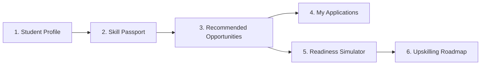

# 06 — Student Portal

## Overview

The **Student Portal** gives students transparent control over their career readiness journey. It replaces static resume submissions with an evidence-grounded **Skill Passport**, provides clear match percentages for internships and placements, enables interactive readiness simulations, and generates personalized learning roadmaps.



---

## 1. Feature Breakdown

### 1. Profile Overview (`1. Student Profile`)
* **Purpose:** Displays candidate demographic and academic background.
* **Displayed Data:** Candidate name, qualification stream (e.g. *Computer Science & Engineering*), degree (*B.Tech*), location (*New Delhi*), institution (*Delhi Institute of Engineering & Technology*), and preferred sector (*IT & Software*).
* **Input / Actions:** Active student profile selector dropdown to switch between demo profiles (Aarav Sharma vs. Priya Patel). Option to upload PDF resumes for AI skill discovery.

### 2. Skill Passport / Opportunity DNA (`2. Skill Passport`)
* **Purpose:** Displays all skills discovered from student project evidence, complete with confidence scores and evidence multipliers.
* **Displayed Data:** Capability chips (e.g., *Python*, *TensorFlow*, *Computer Vision*, *SQL*), proficiency badge (Intermediate, Advanced), confidence percentage (90–95%), and evidence strength multiplier (e.g., 1.81x).
* **Interactive Modal:** Clicking any skill opens a modal showing the exact supporting project evidence (e.g. *Flower Classification using MobileNetV2*) that proved the skill.

### 3. Recommended Opportunities (`3. Recommended Corporate Opportunities`)
* **Purpose:** Shows corporate internship and placement positions ranked by the student's Opportunity DNA match score.
* **Opportunity Cards Display:**
  - Opportunity Title & Company Name (e.g., *AI/ML Engineering Intern (DEMO)* at *Bharat AI Innovations Ltd*).
  - Opportunity Type Badge (`INTERNSHIP` vs `PLACEMENT`).
  - Location, Sector, Monthly Stipend / Salary (₹18,000/mo), and Duration (6 months).
  - Calculated Match Score Percentage (e.g. **63.0%**).
  - "Why this match?" factor breakdown (Capability fit score + preference bonuses).
  - **"Apply Now"** button.

### 4. My Applications (`4. My Applications`)
* **Purpose:** Provides end-to-end tracking for all opportunities applied to by the student.
* **Displayed Table Columns:** Opportunity Title, Company Name, Opportunity Type, Application Submission Date, and Current Status Badge (`Applied`, `Shortlisted`, `Offered`, `Placed`, or `Not Selected`).

### 5. Readiness Simulator (`Readiness Simulator`)
* **Purpose:** Allows students to simulate how acquiring missing skills will directly increase their match score for a target opportunity.
* **Interactive Checklist:** Lists missing or under-proficient required skills (e.g., *Docker*, *SQL*) with their potential contribution boost (+12.2%, +10.2%).
* **Dynamic Score Meters:** Shows **Current Readiness Score** (63.0%) alongside a real-time **Projected Readiness Score** (85.4%) as checkboxes are selected.

### 6. Upskilling Roadmap (`Career Roadmap`)
* **Purpose:** Generates a structured learning path for missing skills identified in the readiness simulator.
* **Displayed Data:** Estimated learning time (e.g. 1.1 months at ~10h/week), prioritized skill gap milestones (Critical Gaps first), and curated learning resource cards (micro-courses, professional certificates, hands-on projects).

---

## 2. End-to-End "Apply Now" Workflow

```
[Student clicks 'Apply Now' on Opportunity Card]
                        ↓
[Frontend calls `api.createApplication({ candidate_id: 7, opportunity_id: 1 })`]
                        ↓
[Backend validates via Pydantic & checks duplicate application rule]
                        ↓
[SQLAlchemy inserts record into `applications` table with status 'applied']
                        ↓
[UI receives HTTP 201 response & displays success toast]
                        ↓
[Card button transforms to disabled 'Applied' state]
                        ↓
['My Applications' tab count increments automatically]
```
