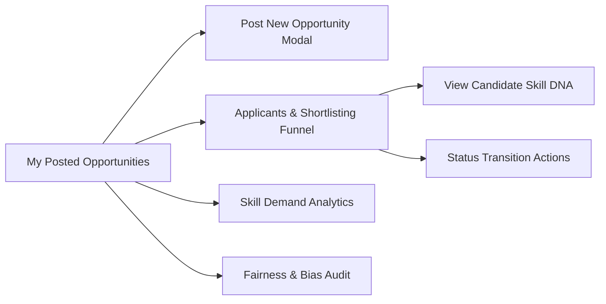

# 07 — Industry Portal

## Overview

The **Industry Partner Portal** (Recruiter Console) allows employers to post structured corporate internship and placement opportunities, rank candidates by verified capability fit, inspect candidate Opportunity DNA profiles, transition applicants through a recruitment funnel, and monitor hiring fairness.



---

## 1. Feature Breakdown

### 1. Posted Opportunities & Opportunity Creation (`My Posted Opportunities`)
* **Purpose:** Manages corporate opportunity listings.
* **Displayed Grid:** Cards displaying title, company, sector, location, monthly compensation, duration, required capabilities, and opportunity type (`INTERNSHIP` vs `PLACEMENT`).
* **Create Opportunity Modal:** Modal form allowing recruiters to post new positions:
  - **Form Fields:** Opportunity Title, Company Name, Opportunity Type (`internship` / `placement`), Duration (months), Monthly Stipend/Salary (₹), Target Location, Industry Sector, Allowed Academic Streams.
  - **Required Skills Selector:** Multi-select dropdown mapping skills from the canonical catalog with required proficiency levels (Beginner, Intermediate, Advanced) and importance weights.

### 2. Applicants & Shortlisting Funnel (`Applicants & Shortlisting`)
* **Purpose:** Provides a candidate management workspace for every posted opportunity.
* **Target Opportunity Selector:** Dropdown to switch view between different corporate postings.
* **Recruitment Funnel Metrics:** Real-time counters showing candidate numbers across status stages:
  $$\text{Applied} \longrightarrow \text{Shortlisted} \longrightarrow \text{Offered} \longrightarrow \text{Placed}$$
* **Applicants Table:**
  - Candidate Name & ID.
  - Calculated DNA Match Score Percentage (e.g. 63.0%).
  - Application Submission Date.
  - Current Status Badge (`applied`, `shortlisted`, `offered`, `placed`, `rejected`).
  - **"View Skill DNA"** button (opens complete candidate Opportunity DNA profile).
  - **Shortlisting Action Buttons:** Contextual status transition triggers (`Shortlist Candidate`, `Extend Offer`, `Mark Placed`, `Reject`).

### 3. Industry Skill Demand Analytics (`Skill Demand Analytics`)
* **Purpose:** Aggregates skill requirements across all corporate opportunities to highlight high-demand capabilities.
* **Visual Displays:** Required skill frequency counts and average importance metrics across industry postings.

### 4. Responsible AI & Fairness Audit (`Fairness & Bias Audit`)
* **Purpose:** Enables recruiters to audit ranking fairness using counterfactual demographic simulations.
* **Audit Summary:** Displays bias audit metrics ensuring non-discrimination across gender, family income, region, and institutional pedigree.

---

## 2. Recruiter Status Transition Workflow

Recruiters manage candidate progression through explicit HTTP `PATCH` calls to `/api/applications/{id}/status`:

```
[Candidate Applies] ──> Status: 'applied'
                           │
             ┌─────────────┴─────────────┐
             ▼                           ▼
    [Shortlist Candidate]            [Reject] ──> Status: 'rejected'
             │
             ▼ Status: 'shortlisted'
             │
             ┌─────────────┴─────────────┐
             ▼                           ▼
      [Extend Offer]                 [Reject] ──> Status: 'rejected'
             │
             ▼ Status: 'offered'
             │
             ┌─────────────┴─────────────┐
             ▼                           ▼
      [Mark Placed]                  [Reject] ──> Status: 'rejected'
             │
             ▼ Status: 'placed'
```
