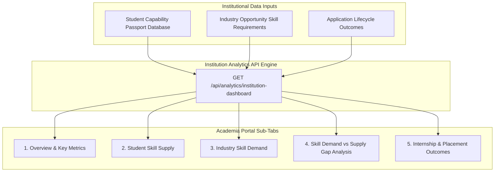

# 08 — Academia Portal

## Overview

The **Academia Portal** (Institutional Skill Intelligence Console) bridges the gap between educational institutions and industry requirements. It gives university leaders, deans, and placement directors actionable visibility into student skill capabilities versus live market demand.

---

## 1. Feature Breakdown & Sub-Tabs

### 1. Institutional Overview & Key Metrics (`Overview`)
* **Purpose:** High-level summary of campus placement and skill metrics.
* **Metric Cards:**
  - **Total Enrolled Students:** Count of active candidates in the institutional database (e.g., 2 demo candidates).
  - **Average Opportunity DNA Match Score:** Campus-wide average match percentage (e.g. 48.6%).
  - **Active Corporate Postings:** Total active internships & placements (e.g., 6 positions).
  - **Successful Placements & Internships:** Count of students in `shortlisted`, `offered`, or `placed` status.

### 2. Student Skill Supply (`Student Skill Supply`)
* **Purpose:** Quantifies the prevalence of specific capabilities across the student body.
* **Analytics Formula:**
  $$\text{Student Supply \%} = \left( \frac{\text{Students Possessing Skill}}{\text{Total Enrolled Students}} \right) \times 100$$
* **Displayed Table:** Skill Name, Capability Category (Data Science, Backend, DevOps), Student Count, Supply Percentage, and Average Proficiency Depth.

### 3. Industry Skill Demand (`Industry Skill Demand`)
* **Purpose:** Aggregates skill requirements across active industry postings.
* **Analytics Formula:**
  $$\text{Industry Demand \%} = \left( \frac{\text{Opportunities Requiring Skill}}{\text{Total Active Opportunities}} \right) \times 100$$
* **Displayed Table:** Skill Name, Required Count, Industry Demand Percentage, and Required Proficiency Level.

### 4. Skill Demand vs. Supply Gap Analysis (`Skill Demand vs Supply`)
* **Purpose:** Identifies institutional skill deficits where industry demand exceeds campus student supply.
* **Net Deficit Formula:**
  $$\text{Net Deficit Gap \%} = \text{Industry Demand \%} - \text{Student Supply \%}$$
* **Priority Categorization:**
  - **CRITICAL GAP (Net Deficit $\ge 30\%$):** Capabilities in high industry demand with low student supply (e.g., *Docker*, *SQL*). Triggers recommendations for immediate curriculum workshops or bootcamps.
  - **MODERATE GAP ($10\% \le \text{Net Deficit} < 30\%$):** Capabilities requiring elective expansion.
  - **ALIGNED / SURPLUS ($\text{Net Deficit} < 10\%$):** Capabilities well-represented on campus (e.g., *Python*, *JavaScript*).
* **Interactive Chart:** Dual bar chart comparing Student Supply % vs. Industry Demand % side-by-side.

### 5. Internship & Placement Outcomes (`Outcomes`)
* **Purpose:** Tracks institutional conversion metrics across internship and permanent placement applications.
* **Displayed Metrics:** Distribution of applications across `applied`, `shortlisted`, `offered`, and `placed` stages.

### 6. Student Capability Drill-Down Modal
* **Purpose:** Clicking any skill in the institutional table opens a drill-down modal showing all students possessing or lacking that skill, along with their individual proficiency and evidence count.

---

## 2. Actionable Value for Academic Institutions

1. **Curriculum Alignment:** College deans can adjust elective courses based on empirical net deficit gap percentages.
2. **Targeted Workshops:** Placement cells can organize short-term bootcamps for identified critical gaps (e.g., Docker containerization).
3. **Data-Driven Accreditation:** Institutions can demonstrate evidence-based skill mapping to accreditation bodies.
