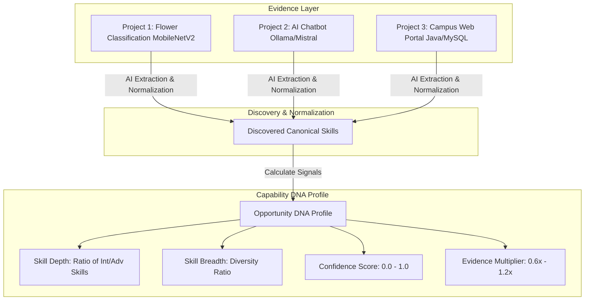

# 09 — Opportunity DNA

## What is Opportunity DNA?

**Opportunity DNA** is the core capability profiling concept of SkillForge. It replaces static, text-heavy resumes with a verifiable, multi-layered capability signal derived directly from a student's actual work artifacts (projects, code, papers, work experience).

---

## 1. Domain Entities & Database Schema Relationship

To understand Opportunity DNA, it is vital to distinguish between its underlying database entities (`models.py`):

| Entity Name | Database Table | Description & Role |
| :--- | :--- | :--- |
| `Candidate` | `candidates` | Represents the student (name, email, stream, degree, preferences). |
| `Evidence` | `evidence` | Represents a specific student artifact (project, repository, paper). |
| `Skill` | `skills` | Canonical skill catalog record (name, category, description). |
| `CandidateSkill` | `candidate_skills` | Maps a candidate to a skill with `proficiency`, `confidence`, and `evidence_count`. |
| `SkillEvidence` | `skill_evidence` | Links a specific candidate skill to the underlying `Evidence` record with extracted text. |
| `Opportunity` | `opportunities` | Represents an internship or placement position posted by industry. |
| `OpportunitySkill` | `opportunity_skills` | Maps an opportunity to a required skill with `importance` and `required_level`. |
| `Recommendation` | `recommendations` | Stores calculated match score and skill gap breakdown for a candidate-opportunity pair. |

---

## 2. Opportunity DNA Signal Formulas (`dna.py`)

The `DNACalculator` service computes four key signal metrics for every student profile:

### 1. Skill Depth Score
Measures the proportion of advanced or intermediate skills relative to total skills:
$$\text{Skill Depth} = \frac{\text{Count of Intermediate, Advanced, or Expert Skills}}{\text{Total Discovered Skills}}$$

### 2. Skill Breadth Score
Measures skill diversity across domain categories, capped at a maximum of 1.0:
$$\text{Skill Breadth} = \min\left(1.0, \frac{\text{Total Discovered Skills}}{10.0}\right)$$

### 3. Average Confidence
The arithmetic mean of AI confidence scores across all discovered candidate skills:
$$\text{Average Confidence} = \frac{\sum_{i=1}^{N} \text{confidence}_i}{N}$$

### 4. Evidence Strength Multiplier
Calculates an evidence weight factor based on the volume of verified artifacts:
$$\text{Evidence Multiplier} = \min\left(1.2, \max\left(0.6, 0.6 + (\text{Total Evidence Items} \times 0.2)\right)\right)$$

---

## 3. Worked Example: Aarav Sharma's DNA Profile

For demo candidate **Aarav Sharma** (ID `#7`):
* **Evidence Items:** 3 projects (*Flower Classification*, *AI Chatbot*, *Campus Web Portal*).
* **Discovered Skills:** 13 capabilities (Python, TensorFlow, Computer Vision, REST APIs, Java, MySQL, SQL, etc.).
* **Computed Signals:**
  - Skill Depth: `0.9` (90% of skills are Intermediate level).
  - Skill Breadth: `0.8` (8 categories covered out of 10).
  - Average Confidence: `0.92` (92% average LLM extraction confidence).
  - Evidence Multiplier: `1.2x` (Capped maximum due to 3 robust project artifacts).

This traceable DNA profile forms the exact baseline used by the **Matching Engine** to compute objective candidate fit.
