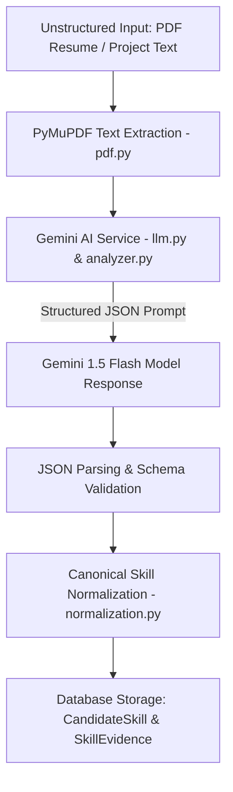

# 10 — AI Skill Extraction

## Overview

The AI Skill Extraction pipeline converts unstructured student project text, code repository summaries, or uploaded PDF resume text into structured, traceable skill capability records.



---

## 1. How AI Extraction Works (`analyzer.py` & `llm.py`)

1. **Document Text Extraction:** If a student uploads a PDF resume, PyMuPDF (`fitz`) extracts raw text while preserving formatting (`pdf.py`).
2. **Structured LLM Prompting:** The `AIAnalyzerService` constructs a strict system prompt instructing Google Gemini to analyze project descriptions and extract skills.
3. **LLM Response Format:** Gemini returns a JSON array containing extracted skills with key metadata:
   ```json
   [
     {
       "skill_name": "TensorFlow",
       "category": "Data Science",
       "proficiency": "Intermediate",
       "confidence": 0.95,
       "supporting_text": "Implemented MobileNetV2 transfer learning pipeline using TensorFlow/Keras."
     }
   ]
   ```
4. **Canonical Mapping:** Raw skill names are passed to `normalization.py` to map variations (e.g. *"TF"*, *"Tensorflow"* $\rightarrow$ `"TensorFlow"`).
5. **Traceable Persistence:** Each extracted skill is saved to `candidate_skills` and linked to the exact `evidence` record via `skill_evidence`.

---

## 2. What AI Does vs. What AI Does NOT Do

| Task / Domain | Responsibility | Handled By |
| :--- | :--- | :--- |
| **Parsing Unstructured Text** | ✅ AI extracts skills from free-form project descriptions. | Gemini AI (`analyzer.py`) |
| **Determining Extraction Confidence**| ✅ AI assigns confidence ratings ($0.0 - 1.0$) based on evidence clarity. | Gemini AI (`analyzer.py`) |
| **Extracting Supporting Snippets** | ✅ AI quotes supporting text snippets for evidence traceability. | Gemini AI (`analyzer.py`) |
| **Canonical Skill Normalization** | ❌ Deterministic dictionary lookup (not AI). | Python (`normalization.py`) |
| **Opportunity Matching Scoring** | ❌ Deterministic multi-factor mathematical formula (not AI). | Python (`matcher.py`) |
| **Readiness Score Calculation** | ❌ Deterministic mathematical matrix multiplication (not AI). | Python (`router.py`) |

---

## 3. Evidence Grounding & Traceability

SkillForge strictly enforces **Evidence Grounding**. An extracted skill cannot exist in isolation; it must be backed by a `SkillEvidence` database record linking it directly to a candidate's project artifact. This prevents keyword stuffing and gives recruiters complete transparency into how every skill score was derived.
