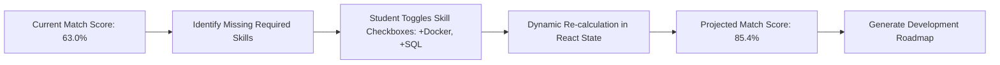

# 13 — Readiness Simulator

## Overview

The **Readiness Simulator** allows students to interactively simulate how acquiring missing skills will boost their match score for a target opportunity.

Instead of presenting match scores as a fixed static grade, SkillForge transforms them into a dynamic, encouraging learning target.

---

## 1. How the Simulator Calculation Works (`router.py` & `App.tsx`)

1. **Endpoint Call:** `GET /api/simulation/readiness?candidate_id=7&opportunity_id=1`
2. **Breakdown Response:** The backend returns a list of required skills categorized by status (`is_met: True` vs `is_met: False`), along with their calculated potential score contribution:
   $$\text{Potential Contribution \%} = \left( \frac{W_{r, \text{skill}}}{\sum W_r} \right) \times 100$$
3. **Frontend Checkbox Reactivity:** In `App.tsx`, selecting a missing skill checkbox dynamically recalculates the projected score:
   $$\text{Projected Score} = \text{Current Score} + \sum_{\text{selected}} \text{Potential Contribution}_i$$

---

## 2. Real Verified Demo Results (Aarav Sharma)

For Aarav Sharma evaluating the **AI/ML Engineering Intern (DEMO)** position:

| Skill Name | Status in Profile | Required Level | Potential Score Boost |
| :--- | :--- | :--- | :--- |
| **Python** | ✅ Met in Profile | Intermediate | Satisfied ($0\%$) |
| **Machine Learning** | ✅ Met in Profile | Intermediate | Satisfied ($0\%$) |
| **TensorFlow** | ✅ Met in Profile | Intermediate | Satisfied ($0\%$) |
| **Computer Vision** | ✅ Met in Profile | Intermediate | Satisfied ($0\%$) |
| **Docker** | ❌ Missing / Gap | Beginner | **$+12.2\%$** |
| **SQL** | ❌ Missing / Gap | Beginner | **$+10.2\%$** |

* **Current Readiness Score:** `63.0%`
* **Projected Score (Both Gaps Acquired):** `85.4%`
* **Net Match Score Boost:** `+22.4%`
