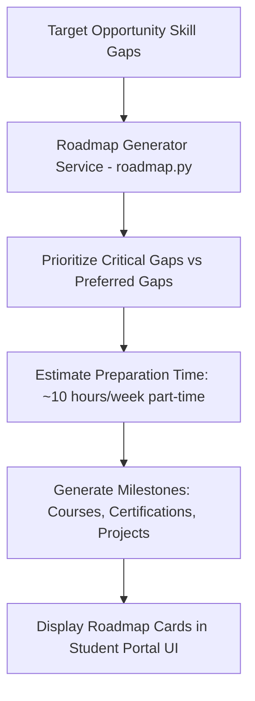

# 14 — Upskilling Roadmap

## Overview

The **Upskilling Roadmap Engine** (`backend/app/services/roadmap.py`) converts identified skill gaps into a structured, personalized career development plan.

When a student identifies missing skills using the Readiness Simulator, SkillForge generates a step-by-step learning roadmap prioritized by criticality.

---

## 1. Roadmap Generation Logic (`roadmap.py`)

1. **Gap Prioritization:** Required skill gaps ($W_r = 1.0$) are designated as **Critical Milestones**, while preferred skill gaps ($W_r < 1.0$) are designated as **Secondary Milestones**.
2. **Estimated Duration Calculation:** Based on required proficiency levels:
   - Beginner Gap: ~20 hours learning time (~2 weeks part-time).
   - Intermediate Gap: ~40 hours learning time (~4 weeks part-time).
3. **Resource Recommendations:** For each missing skill, the roadmap engine populates three curated resource types:
   - **Micro-Courses:** Online modular courses (e.g. *Docker Essentials for Developers*).
   - **Professional Certificates:** Industry-recognized certifications (e.g. *AWS Certified Cloud Practitioner*).
   - **Hands-on Projects:** Practical project ideas (e.g. *Containerize a Flask App with Docker Compose*).

---

## 2. Real Verified Roadmap Example (Aarav Sharma)

For candidate Aarav Sharma:

* **Target Opportunity:** AI/ML Engineering Intern (DEMO)
* **Estimated Preparation Time:** **1.1 months** (~10 hours/week part-time learning)
* **Milestones:**
  1. **Milestone 1: Docker (Critical Gap)**
     - *Course:* Docker & Containerization Essentials (Interactive Course)
     - *Project:* Containerize a Python Machine Learning Inference API using Dockerfile
  2. **Milestone 2: SQL (Critical Gap)**
     - *Course:* Relational Database & SQL Querying Fundamentals
     - *Project:* Design a MySQL database schema for logging ML model prediction logs
