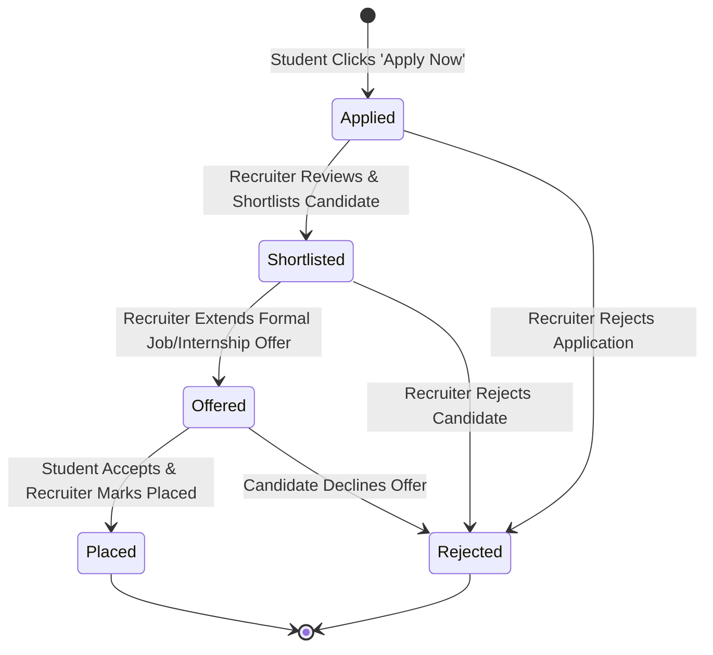
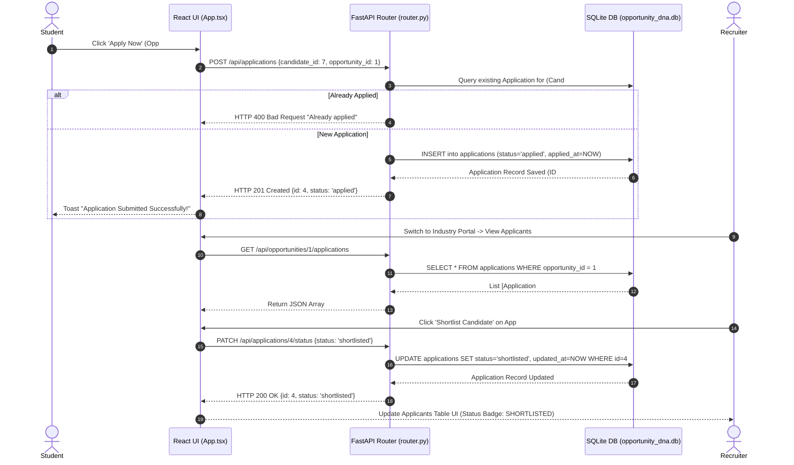

# 15 — Application Lifecycle

## Overview

The **Application Lifecycle** governs candidate submissions for corporate internships and placements, managing status transitions from initial submission to final hiring or rejection.

---

## 1. Valid Status Transitions & Rules

| Current Status | Allowed Target Statuses | Trigger Action | Role Authorized |
| :--- | :--- | :--- | :--- |
| `[None]` | `applied` | Student clicks **"Apply Now"** on opportunity card. | Student |
| `applied` | `shortlisted`, `rejected` | Recruiter clicks **"Shortlist Candidate"** or **"Reject"**. | Recruiter |
| `shortlisted` | `offered`, `rejected` | Recruiter clicks **"Extend Offer"** or **"Reject"**. | Recruiter |
| `offered` | `placed`, `rejected` | Recruiter clicks **"Mark Placed"** or **"Reject"**. | Recruiter |
| `placed` | `[Terminal State]` | Final successful hiring state. | System |
| `rejected` | `[Terminal State]` | Final rejected state. | System |

> **Validation Rule:** Invalid status transitions (e.g. attempting to jump directly from `applied` $\rightarrow$ `placed`) are blocked by FastAPI validation backend exceptions with HTTP 400 Bad Request responses.

---

## 2. API Endpoints & Data Model

* **Application Creation:** `POST /api/applications` (`ApplicationCreate` schema)
* **Status Update:** `PATCH /api/applications/{application_id}/status` (`ApplicationStatusUpdate` schema)
* **Get Candidate Applications:** `GET /api/candidates/{candidate_id}/applications`
* **Get Opportunity Applications:** `GET /api/opportunities/{opportunity_id}/applications`

---

## 3. Application Lifecycle Sequence Diagram

