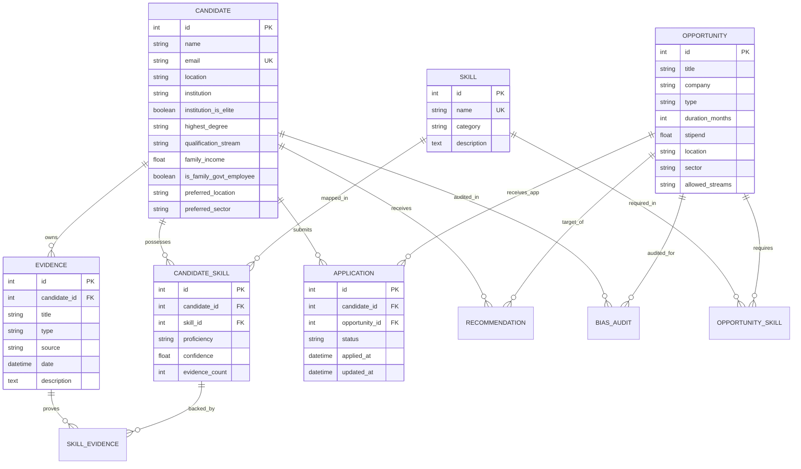

# 16 — Database Design

## Overview

SkillForge uses a relational database schema implemented via SQLAlchemy ORM (`backend/app/models/models.py`) and backed by SQLite (`opportunity_dna.db`).

---

## 1. Entity-Relationship (ER) Diagram

---

## 2. Table Specifications & Column Dictionary

### 1. `candidates` Table
* `id` (INTEGER, PK): Unique candidate identifier.
* `name` (VARCHAR): Candidate full name.
* `email` (VARCHAR, Unique): Contact email address.
* `location` (VARCHAR): Current city/region.
* `institution` (VARCHAR): Educational college/university.
* `institution_is_elite` (BOOLEAN): Tier-1 pedigree indicator.
* `highest_degree` (VARCHAR): Degree qualification (*B.Tech*, *B.Com*).
* `qualification_stream` (VARCHAR): Academic branch (*Computer Science & Engineering*).
* `family_income` (FLOAT): Annual household income.
* `is_family_govt_employee` (BOOLEAN): Government employment flag.
* `preferred_location` (VARCHAR): Target work location.
* `preferred_sector` (VARCHAR): Target industry sector.

### 2. `opportunities` Table
* `id` (INTEGER, PK): Unique opportunity identifier.
* `title` (VARCHAR): Job/internship title (*AI/ML Engineering Intern (DEMO)*).
* `company` (VARCHAR): Hiring company name.
* `type` (VARCHAR): Position type (`internship` vs `placement`).
* `duration_months` (INTEGER): Contract duration in months.
* `stipend` (FLOAT): Monthly stipend/compensation (₹).
* `location` (VARCHAR): Target work city.
* `sector` (VARCHAR): Industry sector (*IT & Software*, *Finance & Banking*).
* `allowed_streams` (TEXT): Permitted academic streams.

### 3. `applications` Table
* `id` (INTEGER, PK): Unique application identifier.
* `candidate_id` (INTEGER, FK $\rightarrow$ `candidates.id`): Applied candidate.
* `opportunity_id` (INTEGER, FK $\rightarrow$ `opportunities.id`): Target position.
* `status` (VARCHAR): Lifecycle state (`applied`, `shortlisted`, `offered`, `placed`, `rejected`).
* `applied_at` (DATETIME): Timestamp of application submission.
* `updated_at` (DATETIME): Timestamp of last status transition.

### 4. `evidence` Table
* `id` (INTEGER, PK): Unique evidence artifact identifier.
* `candidate_id` (INTEGER, FK $\rightarrow$ `candidates.id`): Artifact owner.
* `title` (VARCHAR): Artifact name (*Flower Classification using MobileNetV2*).
* `type` (VARCHAR): Evidence classification (*project*, *work_experience*).
* `source` (VARCHAR): Document source (*Project Evidence*, *Resume*).
* `description` (TEXT): Full project summary text.
