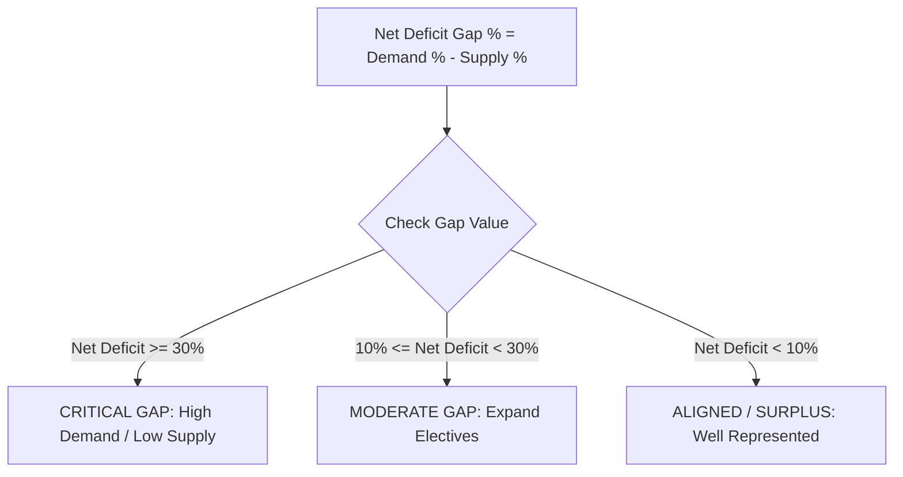

# 18 — Analytics

## Overview

The Analytics engine (`backend/app/api/router.py`) provides real-time data aggregation across three perspectives:
1. **Industry Skill Demand:** What capabilities employers need most.
2. **Student Skill Supply:** What capabilities enrolled students possess.
3. **Institutional Skill Deficits:** Where student supply falls short of industry demand.

---

## 1. Institutional Analytics Formulas (`router.py`)

### 1. Student Skill Supply Percentage
$$\text{Supply \%}(s) = \left( \frac{\text{Unique Candidates Possessing Skill } s}{\text{Total Active Candidates}} \right) \times 100$$

### 2. Industry Skill Demand Percentage
$$\text{Demand \%}(s) = \left( \frac{\text{Opportunities Requiring Skill } s}{\text{Total Active Opportunities}} \right) \times 100$$

### 3. Net Institutional Deficit Gap Percentage
$$\text{Net Deficit Gap \%}(s) = \text{Demand \%}(s) - \text{Supply \%}(s)$$

---

## 2. Gap Priority Classification

SkillForge automatically categorizes skill deficits to help college administrators prioritize intervention:

| Priority Level | Net Deficit Gap Range | Action Recommended for Academia |
| :--- | :--- | :--- |
| **CRITICAL GAP** | $\ge 30\%$ | Organize immediate hands-on technical workshops, hackathons, or bootcamps. |
| **MODERATE GAP** | $10\% \le \text{Gap} < 30\%$ | Integrate skill module into upcoming semester curriculum or elective choices. |
| **ALIGNED / SURPLUS** | $< 10\%$ | Maintain current academic training course content. |

---

## 3. Real Verified Institution Dashboard Output

For the canonical SIH demo dataset:

* **Total Enrolled Students:** 2 candidates (Aarav Sharma, Priya Patel)
* **Active Corporate Positions:** 6 positions (5 Internships, 1 Placement)
* **Identified Critical Skill Deficits:**
  1. **Docker:** Industry Demand: `33.3%` | Student Supply: `0.0%` $\rightarrow$ **Net Deficit: `+33.3%` (CRITICAL GAP)**
  2. **SQL:** Industry Demand: `50.0%` | Student Supply: `0.0%` $\rightarrow$ **Net Deficit: `+50.0%` (CRITICAL GAP)**
* **Aligned / Strong Capabilities:**
  - **Python:** Industry Demand: `33.3%` | Student Supply: `50.0%` $\rightarrow$ **Net Deficit: `-16.7%` (ALIGNED)**
  - **JavaScript:** Industry Demand: `16.7%` | Student Supply: `100.0%` $\rightarrow$ **Net Deficit: `-83.3%` (SURPLUS)**
