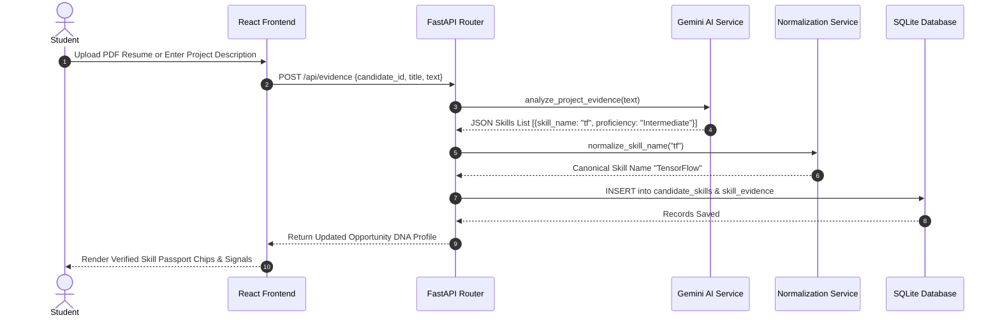
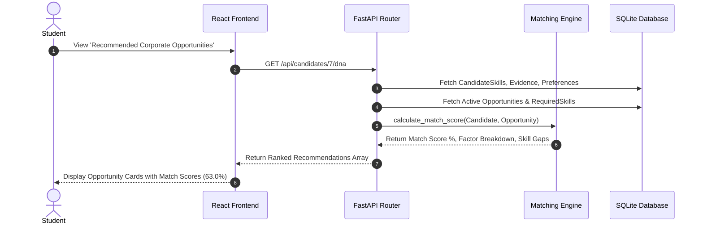
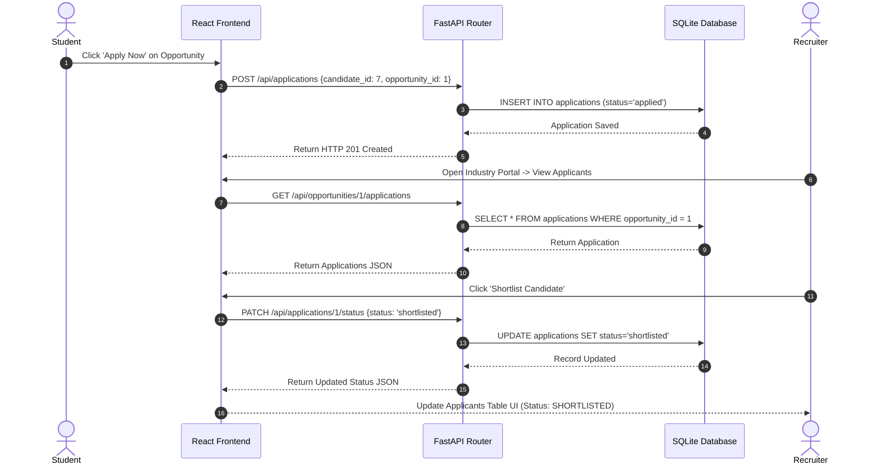
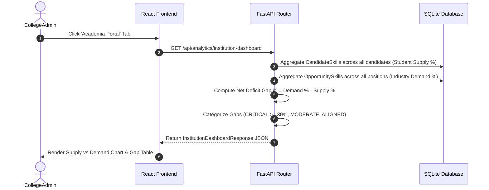

# 20 — Data Flow

## 1. Flow A: Student Evidence to Skill Passport

---

## 2. Flow B: Opportunity Recommendation Matching

---

## 3. Flow C: Application Lifecycle & Recruiter Shortlisting

---

## 4. Flow D: Academia Institutional Analytics

