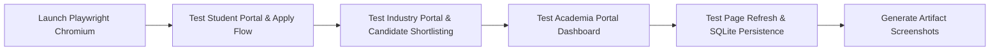

# 22 — Testing and Validation

## Overview

SkillForge maintains a rigorous quality assurance baseline consisting of automated unit tests, regression tests, TypeScript static compilation checks, Vite production build validation, and automated Playwright browser UI testing.

---

## 1. Verified Quality Baseline Summary

```text
================================================================================
SKILLFORGE QUALITY BASELINE VERIFICATION
================================================================================
1. Backend Pytest Suite   : 41 / 41 PASSED (100% test success rate)
2. TypeScript Compiler     : 0 Errors (npx tsc -b passed cleanly)
3. Vite Production Build   : SUCCESSFUL (dist/index.html & assets generated)
4. Playwright Browser QA   : 7 / 7 E2E Workflows PASSED (Student, Industry, Academia)
================================================================================
```

---

## 2. Backend Test Suite Breakdown (`backend/app/tests/`)

The Pytest suite comprises 41 automated test cases spread across 6 test modules:

| Test Module | Test Functions Covered | Key Behaviors Verified |
| :--- | :--- | :--- |
| `test_sih26044.py` | `test_application_creation`, `test_valid_status_transitions`, `test_invalid_status_transitions`, `test_duplicate_application_prevention`, `test_shortlist_persistence`, `test_institution_dashboard_analytics`, `test_opportunity_type_field` | Verifies application DB model, API endpoints, status state transitions, and institutional analytics. |
| `test_matching.py` | `test_exact_proficiency_match`, `test_under_proficient_match`, `test_evidence_multiplier_weighting`, `test_preference_bonuses` | Verifies mathematical accuracy of matching formulas and proficiency scaling. |
| `test_fairness.py` | `test_counterfactual_income_neutrality`, `test_pedigree_independence`, `test_group_bias_audit` | Verifies demographic neutrality and counterfactual score invariance. |
| `test_pipeline.py` | `test_end_to_end_evidence_to_recommendation` | Integration test verifying raw evidence processing through AI extraction, DNA calculation, and matching. |
| `test_regression.py` | `test_resume_upload_atomic_rollback`, `test_markdown_code_fences_cleaning` | Ensures PDF upload error recovery and JSON response cleaning. |
| `test_sih_features.py` | `test_pmis_eligibility_precheck`, `test_upskilling_roadmap_generation` | Verifies PMIS eligibility pre-check rules and roadmap milestone generation. |

---

## 3. Automated Browser E2E UI Testing (`scratch/run_browser_qa.py`)

Using Playwright Chromium automation, every major user flow is tested directly in a real browser session against live servers:



### Verified Browser E2E Test Log Output:
```text
[QA LOG] LIVE BROWSER QA PASS SUMMARY
[QA LOG] STUDENT_PORTAL: PASSED
[QA LOG] APPLICATION_CREATION: PASSED
[QA LOG] INDUSTRY_PORTAL: PASSED
[QA LOG] SHORTLIST_ACTION: PASSED
[QA LOG] INSTITUTION_PORTAL: PASSED
[QA LOG] PERSISTENCE_REFRESH: PASSED
[QA LOG] DB_VERIFICATION: PASSED
```
