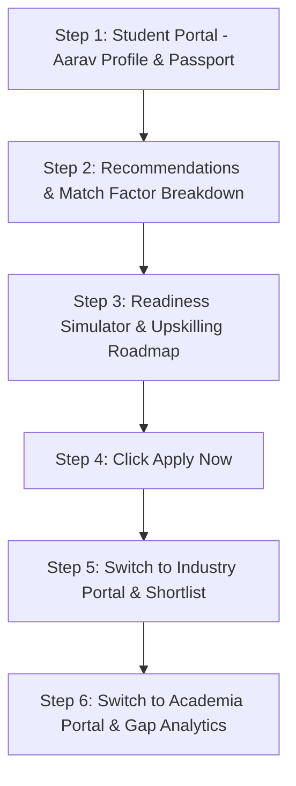

# 25 — Demo Guide

## Quick Elevator Pitches

### 30-Second Elevator Pitch
> *"SkillForge — Opportunity DNA is an AI-powered academia-industry platform for SIH26044. Instead of relying on static resumes or college brand names, SkillForge extracts verifiable skill capabilities directly from student project evidence into an Opportunity DNA Skill Passport. It matches students objectively with internships and placements, allows them to simulate readiness gains by closing skill gaps, and gives universities real-time data on student skill supply versus market demand."*

### 2-Minute Summary
> *"Current hiring and placement portals are broken: recruiters deal with keyword-stuffed resumes, students don't know what skills they lack, and colleges have zero visibility into market demands. SkillForge solves this end-to-end. Students build a traceable Skill Passport where skills like TensorFlow or SQL are linked directly to project evidence. Our deterministic matching engine rates candidates for internships and placements without demographic bias. Students can use our Readiness Simulator to see how acquiring missing skills will boost their match score, while colleges get a live dashboard comparing student supply against industry demand to fix curriculum gaps."*

---

## Step-by-Step 5-Minute Live Demonstration Script

### Step 1: Student Skill Passport (1 minute)
1. Open `http://127.0.0.1:5173`. Select **Student Portal**.
2. Point out **Aarav Sharma**'s profile (*B.Tech Computer Science & Engineering*).
3. Click on **`2. Skill Passport`**. Show capability chips (e.g. *TensorFlow*, *Computer Vision*, *SQL*).
4. Click on the *TensorFlow* chip to open the **Evidence Modal**, showing that the skill is backed by his *Flower Classification using MobileNetV2* project.

### Step 2: Recommendations & Match Transparency (1 minute)
1. Click on **`3. Recommended Corporate Opportunities`**.
2. Show the **AI/ML Engineering Intern (DEMO)** position with a **63.0%** match score.
3. Click *"Why this match?"* to demonstrate transparent scoring (capability score + preference factors).

### Step 3: Readiness Simulator & Roadmap (1 minute)
1. Navigate to **Readiness Simulator**. Point out Aarav's missing skills: **Docker** (+12.2%) and **SQL** (+10.2%).
2. Check both skill boxes live in the UI. Show the **Projected Readiness Score** jump from **63.0%** $\rightarrow$ **85.4%**.
3. Click *"View Development Roadmap"* to display the 1.1-month upskilling plan with curated resource links.

### Step 4: Application & Recruiter Shortlisting (1 minute)
1. Click **"Apply Now"** on the opportunity card. Show the button changing to `"Applied"` and the application appearing in **`4. My Applications`**.
2. Switch top tab to **Industry Partner Portal**. Navigate to **Applicants & Shortlisting**.
3. Select *AI/ML Engineering Intern*. Find Aarav's application and click **"Shortlist Candidate"**. Show status updating to `SHORTLISTED` in real time.

### Step 5: Academia / Institutional Skill Gap Analytics (1 minute)
1. Switch top tab to **Academia Portal**.
2. Show the **Skill Demand vs. Supply** side-by-side bar chart.
3. Point out **Docker** and **SQL** highlighted as **CRITICAL Gaps (Net Deficit $\ge 30\%$)**, demonstrating how university deans can immediately identify curriculum deficiencies across campus.
