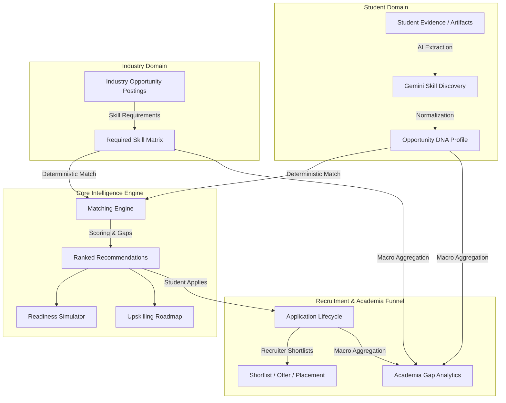

# SkillForge — Complete Project Guide
> **Tagline:** *"Find the opportunity. Understand the gap. Build the path."*  
> **SIH Problem Statement ID:** SIH26044 — *"Portal for Academia - Industry collaboration for Skill Mapping, Internships and Placement"*

---

## Document Sitemap & Sub-Guides

This master guide provides a comprehensive overview of SkillForge — Opportunity DNA. For deep-dive technical specifications, refer to the individual chapters in the `docs/` folder:

1. [00 Project Overview](00_PROJECT_OVERVIEW.md) — High-level summary & core value flow.
2. [01 Problem Statement](01_PROBLEM_STATEMENT.md) — Detailed SIH26044 challenge breakdown.
3. [02 Solution Overview](02_SOLUTION_OVERVIEW.md) — Proposed architecture & strategy.
4. [03 System Architecture](03_SYSTEM_ARCHITECTURE.md) — Component responsibilities & request lifecycle.
5. [04 Technology Stack](04_TECHNOLOGY_STACK.md) — Verified libraries, frameworks & tools.
6. [05 Project Structure](05_PROJECT_STRUCTURE.md) — Repository structure & key files catalog.
7. [06 Student Portal](06_STUDENT_PORTAL.md) — Skill Passport, recommendations & simulator.
8. [07 Industry Portal](07_INDUSTRY_PORTAL.md) — Opportunity posting, shortlisting & recruiter funnel.
9. [08 Academia Portal](08_ACADEMIA_PORTAL.md) — Institutional skill supply vs. demand analytics.
10. [09 Opportunity DNA](09_OPPORTUNITY_DNA.md) — Capability profiling & DNA signal formulas.
11. [10 AI Skill Extraction](10_AI_SKILL_EXTRACTION.md) — Gemini LLM evidence parsing pipeline.
12. [11 Skill Normalization](11_SKILL_NORMALIZATION.md) — Canonical skill taxonomy mapping.
13. [12 Matching Engine](12_MATCHING_ENGINE.md) — Exact mathematical scoring formulas.
14. [13 Readiness Simulator](13_READINESS_SIMULATOR.md) — Interactive readiness score projection.
15. [14 Upskilling Roadmap](14_UPSKILLING_ROADMAP.md) — Personalized gap development plans.
16. [15 Application Lifecycle](15_APPLICATION_LIFECYCLE.md) — Application state machine & transitions.
17. [16 Database Design](16_DATABASE_DESIGN.md) — SQLAlchemy ORM models & ER diagram.
18. [17 API Reference](17_API_REFERENCE.md) — Complete REST endpoint documentation.
19. [18 Analytics](18_ANALYTICS.md) — Institutional supply vs. demand gap formulas.
20. [19 Fairness & Responsible AI](19_FAIRNESS_AND_RESPONSIBLE_AI.md) — Counterfactual bias auditing.
21. [20 Data Flow](20_DATA_FLOW.md) — End-to-end sequence diagrams.
22. [21 Security & Privacy](21_SECURITY_AND_PRIVACY.md) — Security controls & privacy boundaries.
23. [22 Testing & Validation](22_TESTING_AND_VALIDATION.md) — Automated test baseline & browser QA.
24. [23 Demo Data](23_DEMO_DATA.md) — Canonical demo candidate profiles & opportunities.
25. [24 Setup & Run Guide](24_SETUP_AND_RUN_GUIDE.md) — Beginner-friendly installation steps.
26. [25 Demo Guide](25_DEMO_GUIDE.md) — 5-minute judge demonstration script & pitches.
27. [26 SIH26044 Requirement Mapping](26_SIH26044_REQUIREMENT_MAPPING.md) — Compliance matrix.
28. [27 Limitations & Future Scope](27_LIMITATIONS_AND_FUTURE_SCOPE.md) — Future development roadmap.
29. [28 Troubleshooting](28_TROUBLESHOOTING.md) — Practical error diagnosis & fixes.

---

## 1. What is SkillForge?

**SkillForge — Opportunity DNA** is an AI-powered academia-industry collaboration platform designed to align student skillsets with real corporate requirements for internships and permanent placements.

Rather than evaluating candidates using static resumes, keyword matching, or college reputation, SkillForge introduces **Opportunity DNA**—a verifiable, evidence-backed capability passport. By analyzing real student artifacts (projects, code repositories, work experience, certifications), SkillForge builds a multidimensional profile of a student's true technical capabilities, transparently matches them with industry opportunities, quantifies skill gaps, and provides an actionable upskilling path.

---

## 2. The Problem

Higher education systems in India face a persistent challenge in aligning academic training with industry expectations. Despite millions of graduates entering the workforce annually, employers frequently report a significant "employability gap," while students struggle to find suitable internships and placement opportunities:

1. **For Students:** Lack of clarity on what specific technical capabilities employers are looking for and absence of guidance on how to bridge missing skills.
2. **For Industry:** Unverified resumes stuffed with keywords and expensive manual technical screening.
3. **For Academia / Institutions:** Zero real-time visibility into industry skill demands and inability to identify institutional skill gaps across their student body.

---

## 3. The Solution

SkillForge bridges this gap by creating a unified ecosystem where **Student Capabilities $\leftrightarrow$ Industry Requirements $\leftrightarrow$ Academic Curriculum** are continuously synchronized:



---

## 4. How the Whole System Works

1. **Evidence Input:** A student submits project details or uploads a PDF resume.
2. **AI Skill Extraction:** Gemini AI analyzes the unstructured text and extracts capability skills with confidence scores ($0.0 - 1.0$) and supporting snippets.
3. **Canonical Normalization:** Raw skill names (e.g. *"tf"*, *"keras"*) are mapped to standardized canonical catalog records (*TensorFlow*).
4. **Opportunity DNA Generation:** SkillForge calculates the candidate's Opportunity DNA signal (depth, breadth, confidence, evidence multiplier).
5. **Deterministic Matching:** The matching engine compares the student's DNA against corporate internship and placement postings, calculating objective match percentages (e.g. **63.0%**).
6. **Readiness Simulation & Roadmap:** The student views their missing skills (*Docker*, *SQL*), simulates score boosts (up to **85.4%**), and receives a 1.1-month upskilling roadmap.
7. **Application & Recruitment:** The student applies for the position. The recruiter inspects the candidate's verifiable Skill DNA and shortlists them (`applied` $\rightarrow$ `shortlisted`).
8. **Institutional Skill Intelligence:** The university dashboard aggregates campus student supply against industry demand, highlighting critical net deficit gaps ($\ge 30\%$).

---

## 5. Three Portals

### 1. Student Portal
Provides students with an evidence-backed Skill Passport, transparent opportunity rankings, an interactive Readiness Simulator, an Upskilling Roadmap, and an Application Tracker.

### 2. Industry Partner Portal
Allows recruiters to post corporate internships (`type='internship'`) and permanent placements (`type='placement'`), inspect candidate Skill DNA, manage candidate recruitment funnels (`applied` $\rightarrow$ `shortlisted` $\rightarrow$ `offered` $\rightarrow$ `placed`), and monitor hiring fairness.

### 3. Academia Portal
Gives university leadership macro-level visibility into campus student skill supply versus industry demand, identifying high-priority curriculum skill gaps.

---

## 6. Opportunity DNA

Opportunity DNA is derived from four calculated signal metrics (`backend/app/services/dna.py`):

$$\text{Skill Depth} = \frac{\text{Count of Intermediate, Advanced, or Expert Skills}}{\text{Total Discovered Skills}}$$
$$\text{Skill Breadth} = \min\left(1.0, \frac{\text{Total Discovered Skills}}{10.0}\right)$$
$$\text{Average Confidence} = \frac{\sum_{i=1}^{N} \text{confidence}_i}{N}$$
$$\text{Evidence Multiplier} = \min\left(1.2, \max\left(0.6, 0.6 + (\text{Total Evidence Items} \times 0.2)\right)\right)$$

---

## 7. AI Layer

* **Service Path:** `backend/app/services/analyzer.py` & `llm.py`
* **Technology:** Google Gemini AI API (`google-generativeai`)
* **Role:** Parses unstructured project descriptions and PDF resumes into structured JSON skill records with supporting text snippets.
* **Non-Role:** AI does **NOT** determine match scores or make recruitment decisions.

---

## 8. Matching Engine

* **Service Path:** `backend/app/services/matcher.py`
* **Nature:** 100% Deterministic and Mathematical.
* **Exclusion:** Socio-economic attributes (family income, gender, pedigree) are strictly excluded.
* **Weighted Capability Formula:**
  $$\text{Raw Fit Score} = \left( \frac{\sum_{i=1}^{K} R_{s,i} \times W_{r,i}}{\sum_{i=1}^{K} W_{r,i}} \right) \times 100$$
  $$\text{Final Score} = \min\left(100.0, \text{Raw Fit Score} + \text{Stream Bonus} (+1.0) + \text{Location Bonus} (+2.0) + \text{Sector Bonus} (+2.0)\right)$$

---

## 9. Applications Lifecycle

Managed via database transactions in `backend/app/models/models.py` and `router.py`:

```
[Applied] ──────> [Shortlisted] ──────> [Offered] ──────> [Placed]
   │                   │                   │
   └───────────────────┴───────────────────┴───────────> [Rejected]
```

---

## 10. Academia Intelligence

Institutional gap analytics calculated in `backend/app/api/router.py`:

$$\text{Student Supply \%} = \left( \frac{\text{Students Possessing Skill}}{\text{Total Students}} \right) \times 100$$
$$\text{Industry Demand \%} = \left( \frac{\text{Opportunities Requiring Skill}}{\text{Total Opportunities}} \right) \times 100$$
$$\text{Net Deficit Gap \%} = \text{Industry Demand \%} - \text{Student Supply \%}$$

* **CRITICAL GAP:** Net Deficit $\ge 30\%$ (Requires immediate workshop/curriculum adjustment).

---

## 11. Technology Stack

* **Frontend:** React (`^19.2.8`), TypeScript (`~6.0.2`), Vite (`^8.2.0`), Tailwind CSS (`^3.4.19`), Recharts (`^3.10.1`), Lucide React (`^1.33.0`).
* **Backend:** Python (`3.13`), FastAPI (`0.141.1`), Uvicorn (`0.52.4`), SQLAlchemy (`2.0.52`), Pydantic (`2.13.4`), PyMuPDF (`1.28.2`).
* **Database:** SQLite (`opportunity_dna.db`).
* **AI:** Google Gemini AI API (`google-generativeai 0.8.6`).
* **Testing:** Pytest (`8.x`), Playwright (`1.62.0`).

---

## 12. Database Schema

The database model (`backend/app/models/models.py`) consists of 10 key tables: `Candidate`, `Skill`, `CandidateSkill`, `Evidence`, `SkillEvidence`, `Opportunity`, `OpportunitySkill`, `Application`, `Recommendation`, and `BiasAudit`.

---

## 13. API Reference Summary

All endpoints are mounted under `/api` in `backend/app/main.py`:

* `GET /api/candidates` — Fetch candidates.
* `GET /api/candidates/{id}/dna` — Compute Candidate Opportunity DNA.
* `GET /api/opportunities` — Fetch opportunities.
* `POST /api/opportunities` — Post new internship or placement.
* `POST /api/applications` — Submit application.
* `PATCH /api/applications/{id}/status` — Update application status.
* `GET /api/analytics/institution-dashboard` — Compute institution supply vs. demand analytics.
* `GET /api/simulation/readiness` — Compute readiness simulation.

---

## 14. Testing Baseline

* **Backend Pytest Suite:** **41 / 41 PASSED** (`pytest backend/app/tests -q`)
* **TypeScript Compiler:** **0 Errors** (`npx tsc -b`)
* **Vite Production Build:** **Successful** (`npx vite build`)
* **Playwright Browser QA:** **7 / 7 E2E Workflows PASSED**

---

## 15. Running the Project

```powershell
# 1. Start Backend Server
cd c:\Users\aryag\OneDrive\Desktop\Oppurtunity_DNA
.\backend\venv\Scripts\python.exe -m uvicorn backend.app.main:app --host 127.0.0.1 --port 8000

# 2. Start Frontend Server
cd c:\Users\aryag\OneDrive\Desktop\Oppurtunity_DNA\frontend
npx vite --host 127.0.0.1 --port 5173
```

---

## 16. Demo Walkthrough Script (5-Minute Version)

1. **Start as Aarav Sharma:** View Skill Passport & evidence modal.
2. **Show Match:** Point out AI/ML Engineering Intern (63.0% match) and factor breakdown.
3. **Simulate Readiness:** Select Docker & SQL to project score boost to **85.4%**.
4. **Apply & Shortlist:** Click Apply Now, switch to Industry Portal, and shortlist candidate.
5. **Show Academia Analytics:** Switch to Academia Portal and show Docker/SQL flagged as **CRITICAL Gaps ($\ge 30\%$)**.

---

## 17. SIH26044 Mapping

Features 1–9 (Skill Mapping, Opportunity Posting, Capability Matching, Application Funnel, Readiness Simulator, Roadmap, Institutional Dashboard, Bias Auditing) are **100% Implemented**. External government portal API live webhooks are designated as **Future Scope**.

---

## 18. Limitations

* Workspace switching uses UI tabs instead of server OAuth2 JWT.
* Local SQLite database engine used for development and local demo.

---

## 19. Future Scope

* Production OAuth2 / JWT authentication & server RBAC middleware.
* Migration to managed PostgreSQL database.
* Coursera / edX LMS API connectors for automatic course tracking.
